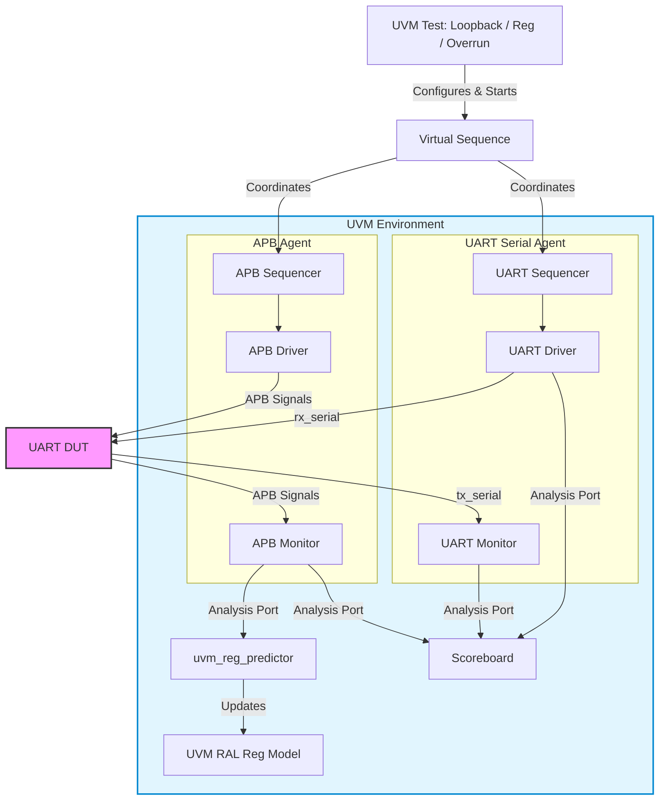

# UVM Verification Environment Guide

This guide provides a detailed technical overview of the **UVM (Universal Verification Methodology) Verification Environment** built to verify the APB-Compliant UART IP.

---

## 1. Verification Architecture

The verification environment is designed to exercise both the parallel register-programming interface (APB) and the serial transmission line interface (TX/RX serial) concurrently.



---

## 2. Component breakdown

### A. APB Agent (Processor/Bus Side)
The APB Agent models a standard host processor reading and writing internal CSR registers.
- **APB Driver** (`apb_driver.sv`):
  - Drives APB bus signals (`PSEL`, `PENABLE`, `PWRITE`, `PADDR`, `PWDATA`).
  - Implements the exact AMBA APB protocol:
    1. **Setup Phase**: Asserts `PSEL=1` and `PENABLE=0` for one clock cycle.
    2. **Access Phase**: Asserts `PENABLE=1` for at least one clock cycle, and waits for `PREADY=1` before deasserting control lines.
- **APB Monitor** (`apb_monitor.sv`):
  - Samples APB interface signals at the active edge of `PCLK` when both `PSEL` and `PENABLE` are high.
  - Converts active cycles into `apb_seq_item` transaction packets and broadcasts them via its analysis port.

### B. UART Serial Agent (External Serial Line Side)
The UART Agent models external transceivers connected to the serial lines.
- **UART Driver** (`uart_driver.sv`):
  - Converts high-level byte transactions into serial bits on the `rx_serial` line.
  - Computes bit-period timings dynamically based on the current baud rate configuration.
  - Formats frames dynamically: Start bit (Low) $\rightarrow$ LSB Data bits $\rightarrow$ Optional parity bit $\rightarrow$ Stop bit(s) (High).
  - Supports **Error Injection** (`ERR_PARITY` to invert computed parity, `ERR_FRAMING` to force stop bit low).
- **UART Monitor** (`uart_monitor.sv`):
  - Detects incoming start bits (falling edge on `tx_serial`).
  - Samples the serial bitstream exactly at the center of each bit period (`1.5` bit cycles for the first data bit, `1.0` bit cycles for subsequent bits).
  - Reconstructs frames, performs parity/framing error checks, and publishes decoded bytes to the Scoreboard.

### C. Register Abstraction Layer (UVM RAL)
A UVM register block (`uart_reg_block.sv`) mirrors all register states of the IP:
- Configures register definitions for `CFG`, `STATUS`, `RIS`, `IER`, `MIS`, `TX_DATA`, and `RX_DATA`.
- **Register Predictor** (`uvm_reg_predictor`): Automatically updates the register model's mirrored state dynamically by listening to the APB Monitor's broadcast transactions.

### D. Scoreboard (`scoreboard.sv`)
Validates correctness of data flow and status/interrupt flag assertions:
- **TX Path Verification**: Matches bytes written to the `TX_DATA` register over APB against bytes captured on the serial `tx_serial` line.
- **RX Path Verification**: Matches bytes driven onto `rx_serial` by the UART driver against bytes read from `RX_DATA` over APB.
- **Data Overrun (DOR) Modeling**: Simulates a single-byte buffer to automatically discard the first byte from the expected queue if a second serial write occurs before the CPU reads the buffer.

---

## 3. Test Cases Description

The environment includes three specific verification tests:

| Test Name | Virtual Sequence | Description |
|-----------|------------------|-------------|
| **`uart_reg_access_test`** | `uart_reg_access_vseq` | Verifies reset values of all registers, writes random configuration options, and reads them back to verify value persistence. |
| **`uart_loopback_test`** | `uart_loopback_vseq` | Performs basic data loopback tests. Programmatically writes to `TX_DATA` and checks serial correctness; drives `rx_serial` and checks APB register read values. |
| **`uart_overrun_test`** | `uart_overrun_vseq` | Disables register reading, drives two back-to-back bytes onto `rx_serial`, and checks that: <br>1. `STATUS.dor` (bit 2) rises to `1`. <br>2. Overrun raw interrupt (`RIS.overrun_error`) fires. <br>3. Reading `RX_DATA` automatically clears flags and interrupts. |

---

## 4. Compilation & Execution Instructions

We provide two dedicated shell scripts in the root directory to run simulations without modifying the existing non-UVM testbench setup.

### CLI Simulation (Command-Line Mode)
Run the script passing the target test name as an argument (defaults to `uart_loopback_test` if left blank):

```bash
# Run Loopback Test
./run_uvm_cli.sh uart_loopback_test

# Run Register Access Test
./run_uvm_cli.sh uart_reg_access_test

# Run Data Overrun Test
./run_uvm_cli.sh uart_overrun_test
```

### GUI Simulation (QuestaSim Waveform Mode)
To view waveforms and debug step-by-step:

```bash
./run_uvm_gui.sh [test_name]
```
This command compiles the files, launches QuestaSim GUI, loads the specified test, logs all signals, and displays the wave window.
